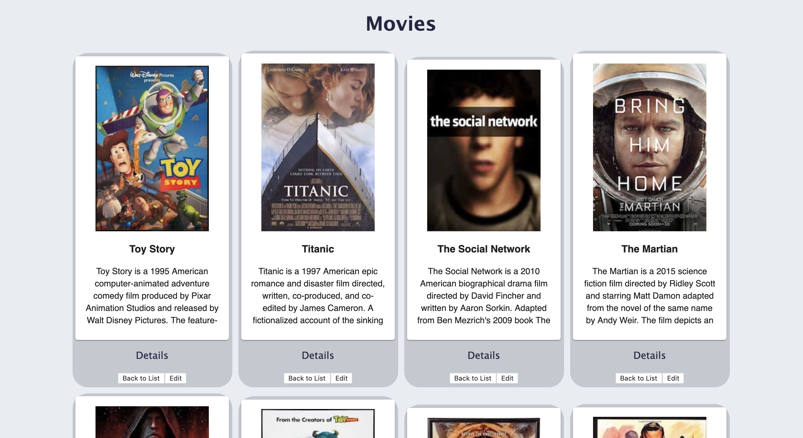

# React-Redux Movie Saga
The technologies used to create this app Redux-Saga, API, React, PostgreSQL, Material-UI, HTML, and CSS.

## Description

This is a basic react-redux movie saga app image posters. The app displays several movies each is in it's own card component and you can scroll through the text in the card to read the movie description. 
 

 ## Install Dependencies and Run
 -npm install
    -npm run server
    -npm run client
-create a database 'saga_movies_weekend'
-Add the default set up in database.sql file to your database.

